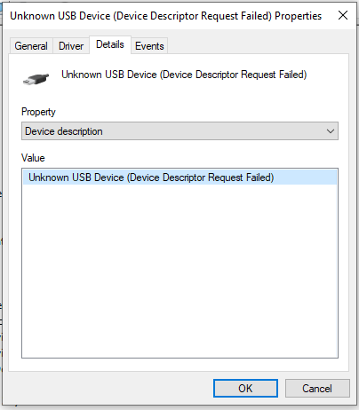
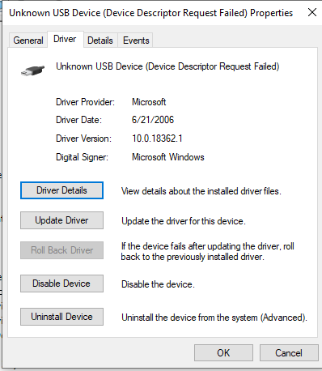
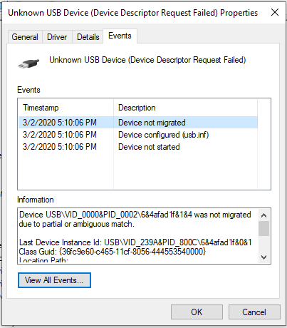
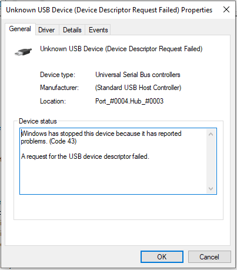

[USB_fomu_AND_feather.pcapng](./USB_fomu_AND_feather.pcapng) is a wireshark USB capture file to determine why fomu and Feather M0 don't play well together.

[USB_fomu_mouse_THEN_feather.pcapng](./USB_fomu_mouse_THEN_feather.pcapng) - capture of the Feather being plugged in with mouse and fomu already there.

The first 52 packets get auto-populated when simply starting Wireshark. (mouse disconnected)

The subsequent packets show the interaction between the fomu and the Adafruit Feather M0, both plugged into a USB hub, when that hub is connected to the host.

See [discussion on twitter](https://twitter.com/tannewt/status/1234869391163981824?s=20)

