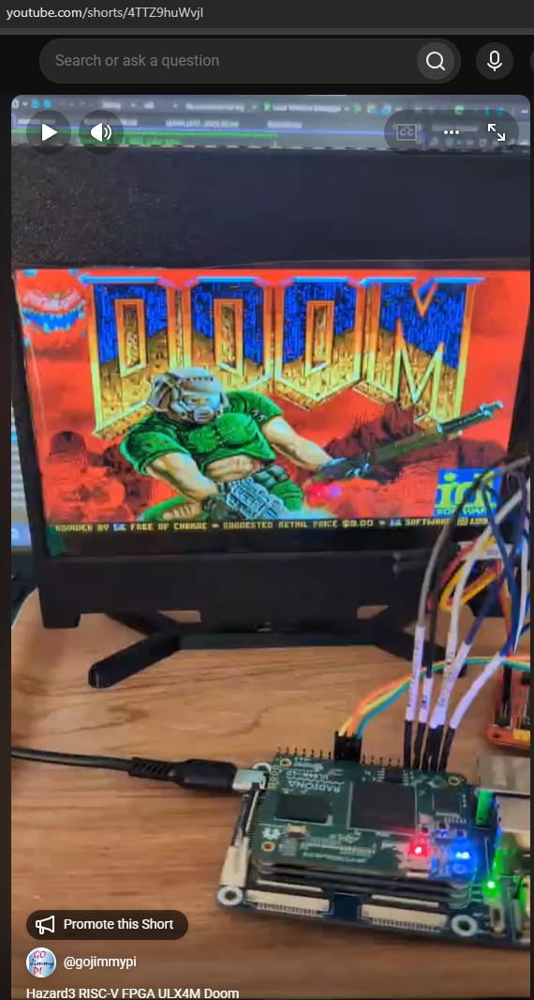
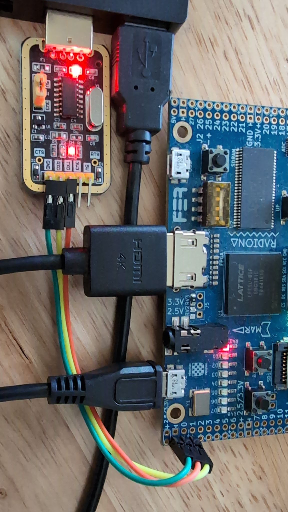

# ULX-DOOM

Doom on the ULX3S 85F and ULX4M-LD 85F using Luke's Hazard3 RISC-V soft FPGA CPU with JTAG single-step debug capabilities.


|  |
|:------:|
| [](https://www.youtube.com/shorts/4TTZ9huWvjI)<br 
| [youtube.com/shorts/4TTZ9huWvjI](https://www.youtube.com/shorts/4TTZ9huWvjI) |

See [Hazard3-Doom](https://github.com/ulx3s/Hazard3-Doom) and the `ulx-doom` branch of [Hazard3 Fork](https://github.com/ulx3s/Hazard3/tree/ulx-doom).

Conceptually:

- Configure the FPGA with the Hazard3 RISC-V SoC bitstream.
- Load monitor/loader firmware that accepts uploads over UART.
- Upload the packaged Doom image from the host computer.
- Upload a compatible Doom IWAD containing the game data.
- Optionally connect to the console with a terminal program and test memory, etc.
- Optionally single-step debug a program running on the soft RISC-V CPU using `gdb` or [VisualGDB](https://visualgdb.com/).

## Quickstart

Here are some instructions for getting started quickly with Doom on the ULX3S 85F and ULX4M-LD 85F.

### Fetch Hazard3-Doom

The [Hazard3-Doom repository](https://github.com/ulx3s/Hazard3-Doom) contains submodules; be sure to clone it recursively from your workspace directory.

```bash
WORKSPACE=/mnt/c/workspace
# or
WORKSPACE=~/workspace

cd "${WORKSPACE}"

git clone --recurse-submodules https://github.com/ulx3s/Hazard3-Doom.git

cd Hazard3-Doom
```

When cloning onto a Windows filesystem from WSL, disable automatic line-ending conversion and file-mode tracking:

```bash
cd "${WORKSPACE}"

git -c core.autocrlf=false clone --recurse-submodules https://github.com/ulx3s/Hazard3-Doom.git

cd Hazard3-Doom

git config core.autocrlf false
git config core.filemode false
```

### Check Build Tools

Ensure the required build tools are installed.

```bash
export PATH="/opt/riscv/bin:$PATH"

for tool in \
    shellcheck \
    make \
    python3 \
    yosys \
    nextpnr-ecp5 \
    ecppack \
    riscv32-unknown-elf-gcc \
    riscv32-unknown-elf-objcopy
do
    command -v "$tool" || echo "MISSING: $tool"
done
```

Windows users can download the [RISC-V toolchain](https://gnutoolchains.com/risc-v/) from Sysprogs,
or use the files in [Hazard3-Doom/bin](https://github.com/ulx3s/Hazard3-Doom/tree/main/bin).

Linux users can bake their own cake.

### Build

To get started more quickly, there is a prebuilt bitstream file called `fpga_ulx3s_hdmi_doom.bit` in the [bin directory](https://github.com/ulx3s/Hazard3-Doom/tree/main/bin).

To build from source:

#### Build for ULX3S 85F

```bash
cd "${WORKSPACE}/Hazard3-Doom"
./scripts/build-ulx3s-doom.sh
```

#### Build for ULX4M-LD 85F

```bash
cd "${WORKSPACE}/Hazard3-Doom"
./scripts/build-ulx4m-ld-doom.sh
```

### Program the FPGA

Use `fujprog` or `openFPGALoader` to load the FPGA bitstream into SRAM. The bitstream configures the FPGA with the soft RISC-V CPU and its peripherals.

#### Program the ULX3S with fujprog from WSL

A bitstream file should have been created in the `${WORKSPACE}/Hazard3-Doom/build/ulx3s` directory.

On Windows, `fujprog` requires the default FTDI driver. After loading the bitstream, replace the ULX3S FT231X driver with `libusbK` using Zadig before starting OpenOCD. Changing the driver does not reset the FPGA.

```bash
cd "${WORKSPACE}/Hazard3-Doom"

# Locally built bitstream:
./bin/fujprog-v48-win64.exe ./build/ulx3s/fpga_ulx3s.bit

# Or use the prebuilt bitstream:
./bin/fujprog-v48-win64.exe ./bin/fpga_ulx3s_hdmi_doom.bit
```

#### Program the ULX4M-LD with openFPGALoader from WSL

A bitstream file should have been created in the `${WORKSPACE}/Hazard3-Doom/build/ulx4m` directory.

```bash
cd "${WORKSPACE}/Hazard3-Doom"
./bin/openFPGALoader.exe --dfu --vid 0x1d50 --pid 0x614b --altsetting 0 ./build/ulx4m/fpga_ulx4m_ld.bit
```

### OpenOCD

The following instructions are specific to the ULX3S. This example uses [OpenOCD](https://www.openocd.org/) to load firmware for the RISC-V soft CPU.

A version built with RISC-V architecture support is required. RISC-V support is included in mainstream OpenOCD releases from version 0.12.0 onward. See also [riscv-openocd](https://github.com/riscv-collab/riscv-openocd).

**NOTE** The ULX3S on-board FT231X requires OpenOCD built with `ft232r` bit-bang support, such as [xPack OpenOCD](https://xpack-dev-tools.github.io/openocd-xpack/).

**NOTE** The ULX3S must use the `libusbK` driver with OpenOCD. Zadig can install or replace this driver. Switch back to the FTDI driver before using the Windows `fujprog` executable again.

Windows users of VisualGDB can find a copy of the tools in the ESP32 toolchain:

```text
C:\SysGCC\esp32\tools\openocd-esp32\v<version>\openocd-esp32\bin\openocd.exe
```

Alternatively, use the OpenOCD executable in the `./bin` directory. Verify that any other downloaded OpenOCD build includes both RISC-V and `ft232r` support.

A small [config file](https://github.com/ulx3s/Hazard3/blob/ulx-doom/example_soc/ulx3s-openocd.cfg) can be used with all the initial commands:

```text
# Probe config specific to ULX3S.

adapter driver ft232r
ft232r vid_pid 0x0403 0x6015

# Note adapter_khz doesn't do anything because this is bitbanged JTAG on aux
# UART pins, but... it's mandatory

adapter speed 1000

ft232r tck_num DSR
ft232r tms_num DCD
ft232r tdi_num RI
ft232r tdo_num CTS
# trst/srst are not used but must have different values than above
ft232r trst_num RTS
ft232r srst_num DTR

# This is the ID for the *FPGA's* chip TAP. (note this ID is for 85F version
# of ULX3S -- if you have a different ECP5 size you can either enter the
# correct ID for your ECP5, or remove the -expected-id part). We are going to
# expose processor debug through a pair of custom DRs on this TAP.

set _CHIPNAME lfe5u85
jtag newtap lfe5u85 hazard3 -expected-id 0x41113043 -irlen 8 -irmask 0xFF -ircapture 0x5

# We expose the DTMCS/DMI DRs you would find on a normal RISC-V JTAG-DTM via
# the ECP5 TAP's ER1/ER2 private instructions. As long as you use the correct
# IR length for the ECP5 TAP, and use the new instructions, the ECP5 TAP
# looks a lot like a JTAG-DTM.

set _TARGETNAME $_CHIPNAME.hazard3
target create $_TARGETNAME riscv -chain-position $_TARGETNAME
riscv set_ir dtmcs 0x32
riscv set_ir dmi 0x38

# That's it, it's a normal RISC-V processor now :)

gdb report_data_abort enable
init
```

Run the OpenOCD server in a dedicated terminal window:

```bash
cd "${WORKSPACE}/Hazard3-Doom"

./bin/openocd.exe -d2 -f ./third_party/Hazard3/example_soc/ulx3s-openocd.cfg
```

Expect output like this:

```
gojimmypi:~/Hazard3-Doom
$ ./bin/openocd.exe -d2 -f ./third_party/Hazard3/example_soc/ulx3s-openocd.cfg
xPack Open On-Chip Debugger 0.12.0+dev-02228-ge5888bda3-dirty (2025-10-04-22:44)
Licensed under GNU GPL v2
For bug reports, read
        http://openocd.org/doc/doxygen/bugs.html
DEPRECATED! use 'gdb report_data_abort', not 'gdb_report_data_abort'
Info : clock speed 1000 kHz
Warn : DEPRECATED: auto-selecting transport "jtag". Use 'transport select jtag' to suppress this message.
Info : JTAG tap: lfe5u85.hazard3 tap/device found: 0x41113043 (mfg: 0x021 (Lattice Semi.), part: 0x1113, ver: 0x4)
Info : datacount=1 progbufsize=2
Info : Disabling abstract command reads from CSRs.
Info : Examined RISC-V core; found 1 harts
Info :  hart 0: XLEN=32, misa=0x40801106
Info : [lfe5u85.hazard3] Examination succeed
Info : [lfe5u85.hazard3] starting gdb server on 3333
Info : Listening on port 3333 for gdb connections
Info : Listening on port 6666 for tcl connections
Info : Listening on port 4444 for telnet connections
Info : accepting 'gdb' connection on tcp/3333
Info : Disabling abstract command writes to CSRs.
Error: No working memory available. Specify -work-area-phys to target.
Warn : not enough working area available(requested 1100)
Info : dropped 'gdb' connection
```

The final working-memory messages may appear when GDB compares sections. They do not indicate a failed firmware load if `load` and `compare-sections` completed successfully.

### Load Firmware with GDB

Load the monitor/loader firmware image with GDB. OpenOCD must already be running.

GDB can be downloaded from the [xPack GNU RISC-V Embedded GCC releases](https://github.com/xpack-dev-tools/riscv-none-elf-gcc-xpack/releases/), or
the Windows `riscv-none-elf-gdb.exe` can be found in the [bin directory](https://github.com/ulx3s/Hazard3-Doom/tree/main/bin).

```batch
set "WORKSPACE=C:\workspace"
cd /d "%WORKSPACE%\Hazard3-Doom"

.\bin\gdb\riscv-none-elf-gdb.exe .\bin\hazard3-test.elf ^
    -batch ^
    -ex "target extended-remote localhost:3333" ^
    -ex "load" ^
    -ex "compare-sections" ^
    -ex "monitor resume 0x40" ^
    -ex "disconnect"
```

In WSL:

```bash
./bin/gdb/riscv-none-elf-gdb.exe ./bin/hazard3-test.elf \
    -batch \
    -ex 'target extended-remote localhost:3333' \
    -ex 'load' \
    -ex 'compare-sections' \
    -ex 'monitor resume 0x40' \
    -ex 'disconnect'
```

Or use the `load_firmware.sh` script:

```bash
cd "${WORKSPACE}/Hazard3-Doom"

./scripts/load_firmware.sh
```

The LEDs on the ULX3S should start blinking after the firmware loads successfully. The program listens on the UART port for Doom image and IWAD uploads.

### Load Doom Executable

This step requires the monitor/loader firmware loaded with GDB in the previous section and the Doom image created during the build.

The ULX3S requires an external USB-to-UART adapter connected as shown:

[](./ULX3S-External-UART.jpg)

Load the Doom image:

```bash
cd "${WORKSPACE}/Hazard3-Doom"

./doom/upload-doom-image.py ./build/doom-image/hazard3-doom.h3d --port /dev/ttyS7
```

Replace `/dev/ttyS7` with the serial port connected to the USB-to-UART adapter.

For Windows, depending on the specific serial port:

```powershell
py ./doom/upload-doom-image.py ./build/doom-image/hazard3-doom.h3d --port COM7
```

### Load a WAD

The ULX3S uses the external USB-to-UART adapter shown in the previous step. Place a compatible IWAD, such as `DOOM1.WAD`, in the `wads` directory before uploading it.

```bash
cd "${WORKSPACE}/Hazard3-Doom"

./doom/upload-wad.py ./wads/DOOM1.WAD --port /dev/ttyS7 --launch
```

For Windows, depending on the specific serial port:

```powershell
py ./doom/upload-wad.py ./wads/DOOM1.WAD --port COM7 --launch
```

### Connect to Monitor Console

Connect to the serial port with your favorite terminal program, such as PuTTY. There are diagnostic commands, some of
which are memory-destructive.

When `upload-wad.py` is run with `--launch`, Doom starts automatically. From the monitor, press `j` to launch or restart Doom manually.

```
Doom interactive HDMI loop: READY

  controls: W/S or arrows move/turn, Z/C strafe, F/space fire, E use

  M map, P pause, 1-7 weapons, Enter select, Esc menu

  Esc backs out of menus; Ctrl-X returns to monitor; j restarts
```

Other monitor-console commands are available:

```text
Commands:
  h or ?  help
  m       destructive reserved 1 MiB SDRAM test (heap-safe)
  a       sparse 64 MiB address/bank alias test
  r       pseudorandom 1 MiB test in each SDRAM bank
  q       complete SDRAM qualification suite
  k       SDRAM heap allocation/stress test
  d       Doom platform memory/timer smoke test
  x       execute copied RV32 code from SDRAM
  l       receive a packaged Doom image over UART
  w       receive an IWAD into reserved SDRAM
  j       launch/restart the validated Doom image and IWAD
  f       rewrite/present the 320x200 RGB332 HDMI test frame
  z       reset heap; invalidates every heap pointer
  s       status
  v       version
```

### Full Clean

```bash
cd "${WORKSPACE}/Hazard3-Doom"

./scripts/full-clean.sh
```

### Troubleshooting

Here are some common troubleshooting suggestions.

#### Missing required executable

Ensure the scripts are marked as executable if an error such as this is encountered:

```
$ ./scripts/build-ulx3s-doom.sh
Missing required executable: /home/gojimmypi/Hazard3-Doom/scripts/build-ulx3s-85f-bitstream.sh
Initialize Hazard3 recursively or set HAZARD3_ROOT correctly.
gojimmypi:~/Hazard3-Doom
$ ls /home/gojimmypi/Hazard3-Doom/scripts/build-ulx3s-85f-bitstream.sh
/home/gojimmypi/Hazard3-Doom/scripts/build-ulx3s-85f-bitstream.sh
```

If the file exists but is not executable, restore its executable permission:

```bash
chmod +x ./scripts/build-ulx3s-85f-bitstream.sh
```

#### Error ft232r not found

Ensure the ULX3S is using the `libusbK` driver. This error occurs when OpenOCD tries to use the default FTDI driver on Windows:

```text
$ ./bin/openocd.exe -d2 -f ./third_party/Hazard3/example_soc/ulx3s-openocd.cfg
xPack Open On-Chip Debugger 0.12.0+dev-02228-ge5888bda3-dirty (2025-10-04-22:44)
Licensed under GNU GPL v2
For bug reports, read
        http://openocd.org/doc/doxygen/bugs.html
DEPRECATED! use 'gdb report_data_abort', not 'gdb_report_data_abort'
Error: libusb_open() failed with LIBUSB_ERROR_NOT_SUPPORTED
Error: ft232r not found: vid=0403, pid=6015, serial=[any]

./third_party/Hazard3/example_soc/ulx3s-openocd.cfg:40: Error:
Traceback (most recent call last):
  File "./third_party/Hazard3/example_soc/ulx3s-openocd.cfg", line 40, in script
    init
```

## Learn More

- Stable ULX Hazard3-Doom: [github.com/ulx3s/Hazard3-Doom](https://github.com/ulx3s/Hazard3-Doom)
- ULX forked Hazard3 RISC-V [submodule](https://github.com/ulx3s/Hazard3-Doom/tree/main/third_party) from [github.com/ulx3s/Hazard3](https://github.com/ulx3s/Hazard3/tree/ulx-doom)
- Doomgeneric [submodule](https://github.com/ulx3s/Hazard3-Doom/tree/main/third_party) from: [github.com/ozkl/doomgeneric](https://github.com/ozkl/doomgeneric)
- HDMI Enclosure: [github.com/gojimmypi/ulx3s-elecrow-7inch-hdmi-enclosure](https://github.com/gojimmypi/ulx3s-elecrow-7inch-hdmi-enclosure)
- Tigard: [github.com/tigard-tools/tigard](https://github.com/tigard-tools/tigard)
- The gojimmypi dev branch: [github.com/gojimmypi/Hazard3/ulx3s-dev](https://github.com/gojimmypi/Hazard3/tree/ulx3s-dev)
- Visual Studio [File Explorer](https://marketplace.visualstudio.com/items?itemName=MadsKristensen.WorkflowBrowser)
- Visual Studio [Verilog Syntax Highlighter](https://marketplace.visualstudio.com/items?itemName=gojimmypi.gojimmypi-verilog-language-extension)

---

Back to [ULX3S project site](https://ulx3s.github.io/). Improve [this page](https://github.com/ulx3s/ulx3s.github.io/blob/master/ulx-doom/index.md).
