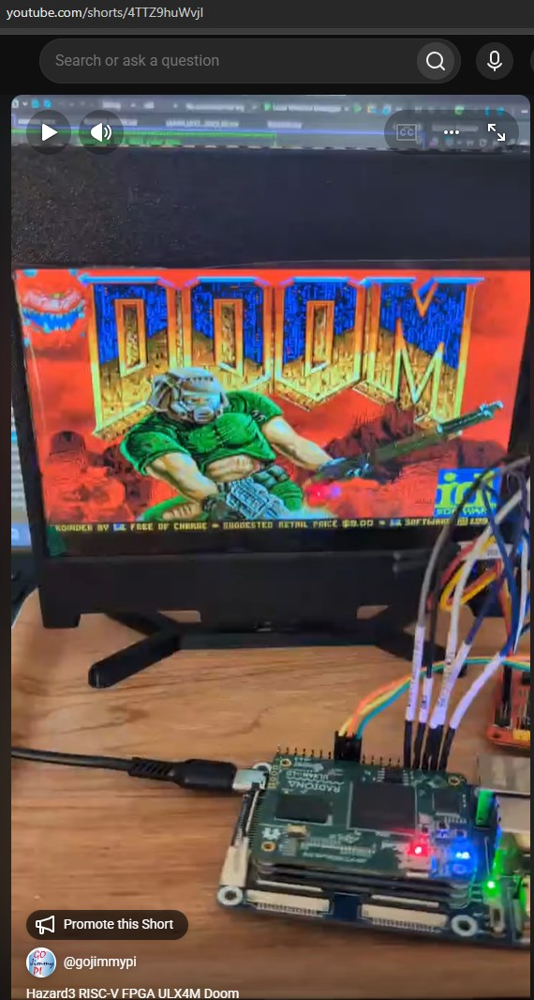
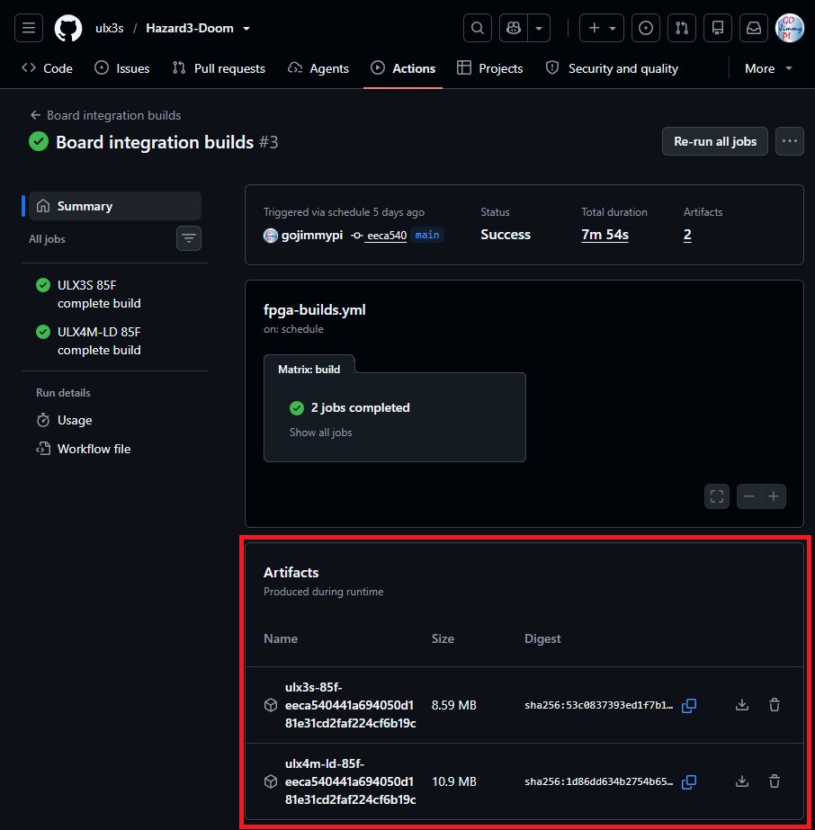
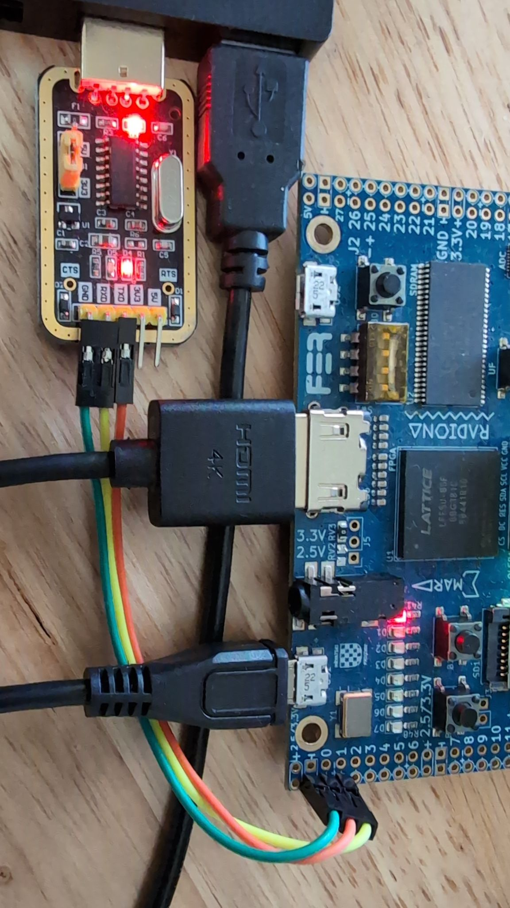
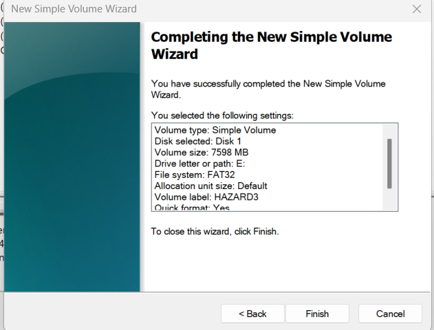

# ULX-DOOM

Doom on the ULX3S 85F, ULX3S 12F, and ULX4M-LD 85F using Luke's Hazard3 RISC-V soft FPGA CPU with HDMI output and JTAG single-step debug capabilities.

| |          | |
| | :------: | |
| | [](https://www.youtube.com/shorts/4TTZ9huWvjI) | |
| | [youtube.com/shorts/4TTZ9huWvjI](https://www.youtube.com/shorts/4TTZ9huWvjI) | |

See [Hazard3-Doom](https://github.com/ulx3s/Hazard3-Doom) and the `ulx-doom` branch of [Hazard3 Fork](https://github.com/ulx3s/Hazard3/tree/ulx-doom).
Full documentation at [hazard3-doom.readthedocs.io](https://hazard3-doom.readthedocs.io/)

Conceptually:

- Configure the FPGA with the Hazard3 RISC-V SoC bitstream. On Windows, the ULX3S on-board FT231X driver depends on the host tool: WinUSB for the browser WebUSB flasher, FTDI VCP/D2XX for Windows `fujprog`, and WinUSB or libusbK for the current OpenOCD `ft232r` path. ULX4M-LD uses its separate Micro-B DFU bootloader for FPGA programming and an external Tigard for JTAG/UART debug.
- Load or update the resident monitor through OpenOCD/GDB when doing a software-only monitor build.
- Upload the packaged Doom `.h3d` image over the separate UART connection, or load it from micro-SD.
- Upload/use a compatible Doom IWAD containing the game data.
- Optionally connect to the UART console with the browser Web Serial UI or a terminal program and run diagnostics.
- Optionally single-step debug a program running on the soft RISC-V CPU using `gdb` or [VisualGDB](https://visualgdb.com/).

### Windows ULX3S USB driver compatibility

The table below applies to the **on-board ULX3S FT231X on US1**. It does not describe the separate CH340/CH341, CP210x, FTDI-UART, or other external USB-to-UART adapter used by the Hazard3-Doom Web Serial console.

<table>
  <thead>
    <tr><th>Tool / path</th><th>WinUSB</th><th>FTDI VCP/D2XX</th><th>libusbK</th></tr>
  </thead>
  <tbody>
    <tr><td>OpenOCD (ULX3S FT231X JTAG)</td><td><span style="display:inline-block;width:.8em;height:.8em;border-radius:50%;background:#2e9d50;margin-right:.35em"></span>Works</td><td><span style="display:inline-block;width:.8em;height:.8em;border-radius:50%;background:#c43d3d;margin-right:.35em"></span>No</td><td><span style="display:inline-block;width:.8em;height:.8em;border-radius:50%;background:#2e9d50;margin-right:.35em"></span>Works</td></tr>
    <tr><td>GDB through OpenOCD</td><td><span style="display:inline-block;width:.8em;height:.8em;border-radius:50%;background:#2e9d50;margin-right:.35em"></span>Works</td><td><span style="display:inline-block;width:.8em;height:.8em;border-radius:50%;background:#c43d3d;margin-right:.35em"></span>No OpenOCD transport</td><td><span style="display:inline-block;width:.8em;height:.8em;border-radius:50%;background:#2e9d50;margin-right:.35em"></span>Works</td></tr>
    <tr><td>Hazard3-Doom WebUSB FPGA/JTAG flasher</td><td><span style="display:inline-block;width:.8em;height:.8em;border-radius:50%;background:#2e9d50;margin-right:.35em"></span>Works</td><td><span style="display:inline-block;width:.8em;height:.8em;border-radius:50%;background:#c43d3d;margin-right:.35em"></span>No</td><td><span style="display:inline-block;width:.8em;height:.8em;border-radius:50%;background:#c43d3d;margin-right:.35em"></span>No</td></tr>
    <tr><td>Windows fujprog / FTDI D2XX tools</td><td><span style="display:inline-block;width:.8em;height:.8em;border-radius:50%;background:#c43d3d;margin-right:.35em"></span>No</td><td><span style="display:inline-block;width:.8em;height:.8em;border-radius:50%;background:#2e9d50;margin-right:.35em"></span>Works</td><td><span style="display:inline-block;width:.8em;height:.8em;border-radius:50%;background:#c43d3d;margin-right:.35em"></span>No</td></tr>
    <tr><td>Web Serial UART / PuTTY on an external USB-UART adapter</td><td><span style="display:inline-block;width:.8em;height:.8em;border-radius:50%;background:#7f8c8d;margin-right:.35em"></span>N/A</td><td><span style="display:inline-block;width:.8em;height:.8em;border-radius:50%;background:#7f8c8d;margin-right:.35em"></span>N/A</td><td><span style="display:inline-block;width:.8em;height:.8em;border-radius:50%;background:#7f8c8d;margin-right:.35em"></span>N/A</td></tr>
  </tbody>
</table>

For the current Hazard3-Doom workflow, **WinUSB is the most convenient FT231X binding when both OpenOCD/GDB and the browser WebUSB flasher are needed**. Switch back to FTDI VCP/D2XX only when an FTDI-native tool such as Windows `fujprog` requires it. Changing the FT231X driver does not reset an already configured FPGA.

## Quickstart

Here are some instructions for getting started quickly with Doom on the ULX3S 85F, compact ULX3S 12F, and ULX4M-LD 85F.

### Fetch Hazard3-Doom

The [Hazard3-Doom repository](https://github.com/ulx3s/Hazard3-Doom) contains submodules; be sure to clone it recursively from your workspace directory.

```bash
WORKSPACE=/mnt/c/workspace
# or
WORKSPACE=~/workspace

cd "${WORKSPACE}"

git clone --recurse-submodules https://github.com/ulx3s/Hazard3-Doom.git

cd Hazard3-Doom
```

Or when testing a specific branch:

```bash
git clone \
    --branch develop \
    --recurse-submodules \
    https://github.com/gojimmypi/Hazard3-Doom.git
```

When cloning onto a Windows filesystem from WSL, disable automatic line-ending conversion and file-mode tracking:

```bash
cd "${WORKSPACE}"

git -c core.autocrlf=false clone --recurse-submodules https://github.com/ulx3s/Hazard3-Doom.git

cd Hazard3-Doom

git config core.autocrlf false
git config core.filemode false
```

### Ensure submodules are current

For an existing clone directory:

```
git submodule update --init --recursive
```
### No Local Toolchain

It is highly recommended to have the toolchain installed locally. It is however, not required.

Generated binaries are included in the GitHub workflow [fpga-builds.yml](https://github.com/ulx3s/Hazard3-Doom/blob/main/.github/workflows/fpga-builds.yml)
actions artifacts:



### Check Build Tools

Ensure the required build tools are installed.

```bash
export PATH="/opt/riscv/bin:$PATH"

for tool in \
    shellcheck \
    make \
    python3 \
    yosys \
    nextpnr-ecp5 \
    ecppack \
    riscv32-unknown-elf-gcc \
    riscv32-unknown-elf-objcopy
do
    command -v "$tool" || echo "MISSING: $tool"
done
```

Windows users can download the [RISC-V toolchain](https://gnutoolchains.com/risc-v/) from Sysprogs,
or use the files in [Hazard3-Doom/bin](https://github.com/ulx3s/Hazard3-Doom/tree/main/bin).

Users of VisualGDB can proceed with the [ulx3s/Hazard3-Doom/VisualGDB/](https://github.com/ulx3s/Hazard3-Doom/blob/main/VisualGDB/README.md) instructions.

Linux users can bake their own cake.

### Build

To get started more quickly, there is a prebuilt bitstream file called `fpga_ulx3s_hdmi_doom.bit` in the [bin directory](https://github.com/ulx3s/Hazard3-Doom/tree/main/bin).

To build everything from source:

#### Build for ULX3S 85F

```bash
cd "${WORKSPACE}/Hazard3-Doom"
./scripts/build-ulx3s-doom.sh
```

#### Build for ULX3S 12F

The compact 12F target defaults to a 32 MiB SDRAM map, a 40 MHz Hazard3 clock,
and the 320x200 Doom/video path.

```bash
cd "${WORKSPACE}/Hazard3-Doom"
./scripts/build-ulx3s-12f-doom.sh
```

#### Build for ULX4M-LD 85F

The hardware-qualified ULX4M-LD profile uses a 40 MHz Hazard3/AHB clock and a
60 MHz LiteDRAM user clock. The normal complete board build is still an
exploratory route and is not the same as the qualified seed-sweep route:

```bash
cd "${WORKSPACE}/Hazard3-Doom"
ALLOW_TIMING_FAILURE=1 ./scripts/build-ulx4m-ld-doom.sh
```

For a bitstream you intend to qualify, use the seed-sweep flow. The current
qualified routing checkpoint is seed 2 with HeAP `timingweight=30`,
`critexp=3`, and timing-driven rip-up. It passed both nextpnr timing and the
hardware DDR tests. Any complete rebuild that changes the netlist must be
rerouted and requalified.

#### Current FPGA validation

These seeds are for the 0.2.0 release.

See the latest default seeds in [scripts/build-ecp5-bitstream-common.sh](https://github.com/ulx3s/Hazard3-Doom/blob/main/scripts/build-ecp5-bitstream-common.sh).

Routing time is taken into account when chosing default seeds.

| Target       | Seed                                                                                           | Routed result       | Status |
| ------------ | ---------------------------------------------------------------------------------------------: |---------------------|----------------|
| ULX3S 85F    | [11](https://github.com/ulx3s/Hazard3-Doom/blob/main/scripts/build-ulx3s-85f-sweep_summary.md) | `clk_sys` 52.24 MHz | PASS at 50 MHz |
| ULX3S 12F    | [82](https://github.com/ulx3s/Hazard3-Doom/blob/main/scripts/build-ulx3s-12f-sweep_summary.md) | `clk_sys` 42.70 MHz | PASS at 40 MHz |
| ULX4M-LD 85F | [83](https://github.com/ulx3s/Hazard3-Doom/blob/main/scripts/build-ulx4m-ld-sweep_summary.md)  | `clk_sys` 43.63 MHz; LiteDRAM 67.51 MHz | PASS at 40 MHz / 60 MHz; DDR hardware-qualified |

These are regression checkpoints for the current RTL, seeds, and tool flow, not
portable timing guarantees. Rerun routed timing after material netlist or
toolchain changes.

#### Build only Console Monitor

This step is included in the "build everything" but can be run separately when the FPGA RTL does not change:

```bash
cd "${WORKSPACE}/Hazard3-Doom"
./scripts/build.sh
```

For a software-only ULX4M-LD monitor matching the qualified 40 MHz FPGA:

```bash
HAZARD3_BUILD_DIR="$PWD/build/ulx4m-ld-40mhz/monitor" \
HAZARD3_MEMORY_PROFILE=64m \
HAZARD3_SYS_CLK_HZ=40000000 \
    ./scripts/build.sh
```

### Program the FPGA

Use [web](https://ulx3s.github.io/Hazard3-Doom/) or `fujprog` for the ULX3S test path. ULX4M-LD uses its DFU bootloader with `openFPGALoader`; after writing the user image, `dfu-util -a 0 -e` explicitly leaves DFU and starts it. The bitstream configures the FPGA with the soft RISC-V CPU and its peripherals.

If the Doom files are loaded on the SD card, an HDMI test pattern should appear and then 
shortly later Doom should launch once the FPGA bitstream is loaded. (see [Load SD Card](./index.html#load-sd-card), below) 

#### Program the ULX3S with fujprog from WSL

The locally built ULX3S 85F bitstream is `${WORKSPACE}/Hazard3-Doom/build/fpga_ulx3s.bit`; the 12F build creates `${WORKSPACE}/Hazard3-Doom/build/fpga_ulx3s_12f.bit`.

On Windows, `fujprog` requires the default FTDI VCP/D2XX driver. 
The current ULX3S OpenOCD `ft232r` path has been verified with **WinUSB as well as libusbK**, 
so libusbK is no longer mandatory. If you also use the browser WebUSB flasher, 
WinUSB is the convenient shared choice for WebUSB and OpenOCD/GDB. 
Changing the FT231X driver does not reset the FPGA.

```bash
cd "${WORKSPACE}/Hazard3-Doom"

# Locally built bitstream:
./bin/fujprog-v48-win64.exe ./build/fpga_ulx3s.bit

# Or use the prebuilt ULX3S 85F bitstream:
./bin/fujprog-v48-win64.exe ./bin/fpga_ulx3s_hdmi_doom.bit

# Locally built ULX3S 12F bitstream:
./bin/fujprog-v48-win64.exe ./build/fpga_ulx3s_12f.bit
```

The compact 12F FPGA image uses a small bootstrap rather than the full resident
monitor in EBR. After programming the 12F FPGA and starting OpenOCD, load the
SDRAM-resident monitor with:

```bash
./scripts/load-firmware-12f.sh
```

#### Program the ULX4M-LD with DFU from WSL

The locally built ULX4M-LD bitstream is `${WORKSPACE}/Hazard3-Doom/build/fpga_ulx4m_ld.bit`.
The ULX4M Micro-B DFU device uses VID:PID `1d50:614b`; this is separate from
Tigard JTAG/UART.

```bash
cd "${WORKSPACE}/Hazard3-Doom"
./bin/openFPGALoader.exe --dfu \
    --vid 0x1d50 --pid 0x614b --altsetting 0 \
    ./build/fpga_ulx4m_ld.bit

# Leave the DFU bootloader and execute the stored user image.
./bin/dfu-util.exe -a 0 -e
```

If the UART is silent and OpenOCD can read ECP5 IDCODE `0x01113043` but reports
`dtmcontrol is 0`, first confirm the board has left DFU and the user bitstream
is running.

#### ULX4M-LD Tigard quick debug setup

Use Tigard in JTAG mode, target power OFF, 3.3 V reference. Configure Windows
once and keep it this way:

| Tigard USB interface | FT2232H channel | Driver | Use |
|---|---|---|---|
| Interface 0 | A | FTDI VCP | 115200 UART COM port |
| Interface 1 | B | libusbK | OpenOCD JTAG |

Do not install libusbK on Interface 0 or the UART COM port disappears. OpenOCD
uses `ftdi channel 1`; the qualified LFE5UM-85F IDCODE is `0x01113043`. The
established Tigard setup has no target reset wire connected.

Start OpenOCD with:

```bash
./bin/openocd.exe -d2 \
    -f ./third_party/Hazard3/example_soc/ulx4m-openocd-tigard.cfg
```

Then load the 40 MHz monitor in another terminal:

```bash
./scripts/load-firmware.sh \
    ./build/ulx4m-ld-40mhz/monitor/hazard3-boot-monitor.elf
```

On the monitor, run `s` and require `external_memory_ready=YES`, then run `q`.
The current qualified route also passes `k` (40 MiB heap stress), `d` (Doom
memory/timer smoke test), and `x` (copied RV32 execution from DDR).

### OpenOCD

This step is not require when loading from the SD Card. (see [Load SD Card](./index.html#load-sd-card), below)

The following instructions are specific to the ULX3S. This example uses [OpenOCD](https://www.openocd.org/) to load firmware for the RISC-V soft CPU.

A version built with RISC-V architecture support is required. RISC-V support is included in mainstream OpenOCD releases from version 0.12.0 onward. See also [riscv-openocd](https://github.com/riscv-collab/riscv-openocd).

**NOTE** The ULX3S on-board FT231X requires OpenOCD built with `ft232r` bit-bang support, such as [xPack OpenOCD](https://xpack-dev-tools.github.io/openocd-xpack/).

**NOTE** On Windows, the current ULX3S OpenOCD `ft232r` path works with the on-board FT231X bound to **WinUSB or libusbK**. 
WinUSB is preferred when the same machine also uses the Hazard3-Doom browser WebUSB flasher. The default FTDI VCP/D2XX driver is still required by Windows `fujprog`. Zadig can switch the FT231X binding when needed.

Windows users of VisualGDB can find a copy of the tools in the ESP32 toolchain:

```text
C:\SysGCC\esp32\tools\openocd-esp32\v<version>\openocd-esp32\bin\openocd.exe
```

Alternatively, use the OpenOCD executable in the `./bin` directory. Verify that any other downloaded OpenOCD build includes both RISC-V and `ft232r` support.

A small [config file](https://github.com/ulx3s/Hazard3/blob/ulx-doom/example_soc/ulx3s-openocd.cfg) can be used with all the initial commands:

```text
# Probe config specific to ULX3S.

adapter driver ft232r
ft232r vid_pid 0x0403 0x6015

# Note adapter_khz doesn't do anything because this is bitbanged JTAG on aux
# UART pins, but... it's mandatory

adapter speed 1000

ft232r tck_num DSR
ft232r tms_num DCD
ft232r tdi_num RI
ft232r tdo_num CTS
# trst/srst are not used but must have different values than above
ft232r trst_num RTS
ft232r srst_num DTR

# This is the ID for the *FPGA's* chip TAP. (note this ID is for 85F version
# of ULX3S -- if you have a different ECP5 size you can either enter the
# correct ID for your ECP5, or remove the -expected-id part). We are going to
# expose processor debug through a pair of custom DRs on this TAP.

set _CHIPNAME lfe5u85
jtag newtap lfe5u85 hazard3 -expected-id 0x41113043 -irlen 8 -irmask 0xFF -ircapture 0x5

# We expose the DTMCS/DMI DRs you would find on a normal RISC-V JTAG-DTM via
# the ECP5 TAP's ER1/ER2 private instructions. As long as you use the correct
# IR length for the ECP5 TAP, and use the new instructions, the ECP5 TAP
# looks a lot like a JTAG-DTM.

set _TARGETNAME $_CHIPNAME.hazard3
target create $_TARGETNAME riscv -chain-position $_TARGETNAME
riscv set_ir dtmcs 0x32
riscv set_ir dmi 0x38

# That's it, it's a normal RISC-V processor now :)

gdb report_data_abort enable
init
```

Run the OpenOCD server in a dedicated terminal window:

```bash
cd "${WORKSPACE}/Hazard3-Doom"

# Set debug level 2
./bin/openocd.exe -d2 -f ./third_party/Hazard3/example_soc/ulx3s-openocd.cfg
```

Or from a DOS prompt:

```dos
.\bin\openocd.exe -f ".\third_party\Hazard3\example_soc\ulx3s-openocd.cfg"
```

Expect output like this:

```
gojimmypi:~/Hazard3-Doom
$ ./bin/openocd.exe -d2 -f ./third_party/Hazard3/example_soc/ulx3s-openocd.cfg
xPack Open On-Chip Debugger 0.12.0+dev-02228-ge5888bda3-dirty (2025-10-04-22:44)
Licensed under GNU GPL v2
For bug reports, read
        http://openocd.org/doc/doxygen/bugs.html
DEPRECATED! use 'gdb report_data_abort', not 'gdb_report_data_abort'
Info : clock speed 1000 kHz
Warn : DEPRECATED: auto-selecting transport "jtag". Use 'transport select jtag' to suppress this message.
Info : JTAG tap: lfe5u85.hazard3 tap/device found: 0x41113043 (mfg: 0x021 (Lattice Semi.), part: 0x1113, ver: 0x4)
Info : datacount=1 progbufsize=2
Info : Disabling abstract command reads from CSRs.
Info : Examined RISC-V core; found 1 harts
Info :  hart 0: XLEN=32, misa=0x40801106
Info : [lfe5u85.hazard3] Examination succeed
Info : [lfe5u85.hazard3] starting gdb server on 3333
Info : Listening on port 3333 for gdb connections
Info : Listening on port 6666 for tcl connections
Info : Listening on port 4444 for telnet connections
Info : accepting 'gdb' connection on tcp/3333
Info : Disabling abstract command writes to CSRs.
Error: No working memory available. Specify -work-area-phys to target.
Warn : not enough working area available(requested 1100)
Info : dropped 'gdb' connection
```

If OpenOCD is already running, you may need to kill it first:

```dos
REM DOS/Windows:
taskkill /F /IM openocd.exe 2>nul
netstat -ano | findstr LISTENING | findstr :3333
```

The final working-memory messages may appear when GDB compares sections. They do not indicate a failed firmware load if `load` and `compare-sections` completed successfully.

### Load Firmware with GDB

This step is not require when loading from the SD Card. (see [Load SD Card](./index.html#load-sd-card), below)

Load the monitor/loader firmware image with GDB. OpenOCD must already be running.

GDB can be downloaded from the [xPack GNU RISC-V Embedded GCC releases](https://github.com/xpack-dev-tools/riscv-none-elf-gcc-xpack/releases/), or
the Windows `riscv-none-elf-gdb.exe` can be found in the [bin directory](https://github.com/ulx3s/Hazard3-Doom/tree/main/bin).

```batch
set "WORKSPACE=C:\workspace"
cd /d "%WORKSPACE%\Hazard3-Doom"

.\bin\gdb\riscv-none-elf-gdb.exe .\bin\hazard3-test.elf ^
    -batch ^
    -ex "target extended-remote localhost:3333" ^
    -ex "load" ^
    -ex "compare-sections" ^
    -ex "monitor resume 0x40" ^
    -ex "disconnect"
```

In WSL:

```bash
./bin/gdb/riscv-none-elf-gdb.exe ./bin/hazard3-test.elf \
    -batch \
    -ex 'target extended-remote localhost:3333' \
    -ex 'load' \
    -ex 'compare-sections' \
    -ex 'monitor resume 0x40' \
    -ex 'disconnect'
```

Or use the `load_firmware.sh` script:

```bash
cd "${WORKSPACE}/Hazard3-Doom"

./scripts/load-firmware.sh
```

The LEDs on the ULX3S should start blinking after the firmware loads successfully. The program listens on the UART port for Doom image and IWAD uploads.

### Load Doom Executable

This step is not require when loading from the SD Card. (see [Load SD Card](./index.html#load-sd-card), below)

This step requires the monitor/loader firmware loaded with GDB in the previous section and the Doom image created during the build.

The ULX3S requires an external 3v3 USB-to-UART adapter connected as shown:

[](./images/ULX3S-External-UART.jpg)

Load the Doom image:

```bash
cd "${WORKSPACE}/Hazard3-Doom"

./doom/upload-doom-image.py ./build/doom-image/hazard3-doom.h3d --port /dev/ttyS7
```

Replace `/dev/ttyS7` with the serial port connected to the USB-to-UART adapter.

For Windows, depending on the specific serial port:

```powershell
py ./doom/upload-doom-image.py ./build/doom-image/hazard3-doom.h3d --port COM7
```

### Load a WAD

This step is not required when loading from the SD Card. (see [Load SD Card](./index.html#load-sd-card), below)

The ULX3S uses the external USB-to-UART adapter shown in the previous step. Place a compatible IWAD, such as `DOOM1.WAD`, in the `wads` directory before uploading it.

```bash
cd "${WORKSPACE}/Hazard3-Doom"

./doom/upload-wad.py ./wads/DOOM1.WAD --port /dev/ttyS7 --launch
```

For Windows, depending on the specific serial port:

```powershell
py ./doom/upload-wad.py ./wads/DOOM1.WAD --port COM7 --launch
```

### Load SD Card

When using the ULX3S SD Card, for instance formatted in Windows like this 
(note FAT32 file system)



Doom files can be copied to the root of the SD card, named exactly:

- `FPGA.BIT`
- `DOOM.H3D`
- `DOOM.WAD`

For example, like this:


### Connect to Monitor Console

Connect to the serial port with your favorite terminal program, such as PuTTY. There are diagnostic commands, some of
which are memory-destructive.

When `upload-wad.py` is run with `--launch`, Doom starts automatically. From the monitor, press `j` to launch or restart Doom manually.

```
Doom interactive HDMI loop: READY

  controls: W/S or arrows move/turn, Z/C strafe, F/space fire, E use

  M map, P pause, 1-7 weapons, Enter select, Esc menu

  Esc backs out of menus; Ctrl-X returns to monitor; j restarts
```

Other monitor-console commands are available:

```text
Commands:
  h or ?  help
  m       destructive reserved 1 MiB SDRAM test (heap-safe)
  a       sparse 64 MiB address/bank alias test
  r       pseudorandom 1 MiB test in each SDRAM bank
  q       complete SDRAM qualification suite
  k       SDRAM heap allocation/stress test
  d       Doom platform memory/timer smoke test
  x       execute copied RV32 code from SDRAM
  l       receive a packaged Doom image over UART
  w       receive an IWAD into reserved SDRAM
  j       launch/restart the validated Doom image and IWAD
  f       rewrite/present the 320x200 RGB332 HDMI test frame
  z       reset heap; invalidates every heap pointer
  s       status
  v       version
```

### Full Clean

```bash
cd "${WORKSPACE}/Hazard3-Doom"

./scripts/full-clean.sh
```

### Troubleshooting

Here are some common troubleshooting suggestions.

#### Timed out waiting for loader response

The `hazard3-test.elf` (either prebuilt in `./bin/` or fresh build in `./build`) Console Monitor
must be loaded onto the device before loading Doom via the python scripts, otherwise this error is expected:

```text
$ ./doom/upload-doom-image.py  ./build/doom-image/hazard3-doom.h3d  --port /dev/ttyS7
Opening /dev/ttyS7 at 115200; payload=586272, CRC32=0xc94f45cf
error: timed out waiting for loader response
```

#### Missing required executable

Ensure the scripts are marked as executable if an error such as this is encountered:

```
$ ./scripts/build-ulx3s-doom.sh
Missing required executable: /home/gojimmypi/Hazard3-Doom/scripts/build-ulx3s-85f-bitstream.sh
Initialize Hazard3 recursively or set HAZARD3_ROOT correctly.
gojimmypi:~/Hazard3-Doom
$ ls /home/gojimmypi/Hazard3-Doom/scripts/build-ulx3s-85f-bitstream.sh
/home/gojimmypi/Hazard3-Doom/scripts/build-ulx3s-85f-bitstream.sh
```

If the file exists but is not executable, restore its executable permission:

```bash
chmod +x ./scripts/build-ulx3s-85f-bitstream.sh
```

#### Error ft232r not found

Ensure the ULX3S on-board FT231X is using **WinUSB or libusbK** when running the current libusb-based OpenOCD `ft232r` path. WinUSB has been verified working and is preferred when you also use the browser WebUSB flasher. The default FTDI VCP/D2XX binding is for FTDI-native applications such as Windows `fujprog`.

This error can occur when OpenOCD tries to use an incompatible Windows binding:

```text
$ ./bin/openocd.exe -d2 -f ./third_party/Hazard3/example_soc/ulx3s-openocd.cfg
xPack Open On-Chip Debugger 0.12.0+dev-02228-ge5888bda3-dirty (2025-10-04-22:44)
Licensed under GNU GPL v2
For bug reports, read
        http://openocd.org/doc/doxygen/bugs.html
DEPRECATED! use 'gdb report_data_abort', not 'gdb_report_data_abort'
Error: libusb_open() failed with LIBUSB_ERROR_NOT_SUPPORTED
Error: ft232r not found: vid=0403, pid=6015, serial=[any]

./third_party/Hazard3/example_soc/ulx3s-openocd.cfg:40: Error:
Traceback (most recent call last):
  File "./third_party/Hazard3/example_soc/ulx3s-openocd.cfg", line 40, in script
    init
```

#### Cannot find JTAG cable

After changing drivers the ULX3S is still not recognized by `fujprog`: try unplugging, wait, then reconnect `US1`. Confirm with Zadig that the FT231X binding matches the tool: FTDI VCP/D2XX for Windows `fujprog`, or WinUSB/libusbK for the current OpenOCD path.

```
ULX2S / ULX3S JTAG programmer v4.8 (git 96ebb45 built Oct  7 2020 22:42:00)
Copyright (C) Marko Zec, EMARD, gojimmypi, kost and contributors
FT_Open() failed
Cannot find JTAG cable.
```

#### Web Serial no longer finds the external UART after debug activity

The Web Serial UART and the ULX3S FT231X/JTAG connection are separate USB devices. A verified Windows/Chrome failure mode is that Chrome logs the external COM port as removed during a debug session and does not add it again when OpenOCD is simply stopped. PuTTY may still be able to open the COM port because Windows still has the serial device, while Chrome's Web Serial enumeration remains stale.

Recovery:

1. Close PuTTY, upload scripts, and other serial-port owners.
2. Stop OpenOCD.
3. Physically unplug and reconnect **the external USB-UART adapter**. Stopping OpenOCD alone may not force Chrome to re-enumerate it.
4. Check `chrome://device-log/?types=Serial,USB&refresh=1` for a fresh `Serial device added` event.
5. Use **Connect** in the Hazard3-Doom web UI to reopen the browser device chooser.

Do not change the external UART adapter to WinUSB merely because the ULX3S FT231X uses WinUSB. A normal CH340/CH341 UART should remain on its normal Windows serial driver so it continues to provide a COM port.

#### Error: could not open port Access is denied

The scripts must have exclusive access to the serial ports. If anything else is connected, an error like this may occur:

```
C:\temp\Hazard3-Doom>py .\doom\upload-doom-image.py .\bin\hazard3-doom.h3d --port COM7
Opening COM7 at 115200; payload=586272, CRC32=0xc94f45cf
error: could not open port 'COM7': PermissionError(13, 'Access is denied.', None, 5)
```
The error above may also occur if the `Tx` or `Rx` pins do not have a good electrical connection. It is recommends to
also connected the TTY/USB Ground write, but *NOT* any power pins. Use Vcc=3v3 only

#### No such file or directory: DOOM1.WAD

A Doom wad file is not distributed in this repository. Find a Doom WAD file, such as the `doom_dos.ZIP/DOOM1.WAD` 
in the [DOOM v1.9 (Shareware Episode, 1995)](https://archive.org/details/doom_20230531) zip download.

```text
py ./doom/upload-wad.py ./wads/DOOM1.WAD --port COM7 --launch
error: [Errno 2] No such file or directory: 'wads\\DOOM1.WAD'
```

#### Warning No such file or directory

Compile in WSL and load firmware with DOS to encounter this error.

```
Running RISC-V GDB...

GDB: "C:\temp\Hazard3-Doom\bin\gdb\riscv-none-elf-gdb.exe"
ELF: "C:\temp\Hazard3-Doom\build\hazard3-test.elf"
uart_getc_nonblocking (value=<synthetic pointer>) at /mnt/c/temp/Hazard3-Doom/src/main.c:250
warning: 250    /mnt/c/temp/Hazard3-Doom/src/main.c: No such file or directory
```

Note that `/mnt/c/` is from WSL and is not a valid path in DOS.

## Learn More

- Stable ULX Hazard3-Doom: [github.com/ulx3s/Hazard3-Doom](https://github.com/ulx3s/Hazard3-Doom)
- ULX forked Hazard3 RISC-V [submodule](https://github.com/ulx3s/Hazard3-Doom/tree/main/third_party) from [github.com/ulx3s/Hazard3](https://github.com/ulx3s/Hazard3/tree/ulx-doom)
- Doomgeneric [submodule](https://github.com/ulx3s/Hazard3-Doom/tree/main/third_party) from: [github.com/ozkl/doomgeneric](https://github.com/ozkl/doomgeneric)
- HDMI Enclosure: [github.com/gojimmypi/ulx3s-elecrow-7inch-hdmi-enclosure](https://github.com/gojimmypi/ulx3s-elecrow-7inch-hdmi-enclosure)
- Tigard: [github.com/tigard-tools/tigard](https://github.com/tigard-tools/tigard)
- The gojimmypi dev branch: [github.com/gojimmypi/Hazard3/ulx3s-dev](https://github.com/gojimmypi/Hazard3/tree/ulx3s-dev)
- Visual Studio [File Explorer](https://marketplace.visualstudio.com/items?itemName=MadsKristensen.WorkflowBrowser)
- Visual Studio [Verilog Syntax Highlighter](https://marketplace.visualstudio.com/items?itemName=gojimmypi.gojimmypi-verilog-language-extension)
- [Another tale of building a Doom port for RISC-V](https://armaangomes.com/blogs/doom/)

---

## Development Status

The `scripts/hazard3-doom-source-status.sh` may be helpful in determining the status of various submodule branches.

Pull requests for `Wren6991/Hazard3` should be opened on `develop` branch. See [contributing notes](https://github.com/ulx3s/Hazard3/blob/ulx-doom/Contributing.md#pull-requests).


### gojimmypi repository owner compares

#### Active Development Compare

- gojimmypi Hazard3 `ulx-doom-dev` vs release [ulx3s/Hazard3/ulx-doom ... gojimmypi/Hazard3/ulx-doom-dev](https://github.com/ulx3s/Hazard3/compare/ulx-doom...gojimmypi:Hazard3:ulx-doom-dev?expand=1) 

#### Hazard3 Doom Project

- [ulx3s/Hazard3-Doom/main ... gojimmypi/Hazard3-Doom/develop](https://github.com/ulx3s/Hazard3-Doom/compare/main...gojimmypi:Hazard3-Doom:develop?expand=1) 

#### Hazard3 RISC-V CPU submodule vs upstream `ulx3s/Hazard3` repository branches:

- [ulx3s/Hazard3/stable ... gojimmypi/Hazard3/ulx-doom-dev](https://github.com/ulx3s/Hazard3/compare/stable...gojimmypi:Hazard3:ulx-doom-dev?expand=1) (dev vs stable)
- [ulx3s/Hazard3/develop ... gojimmypi/Hazard3/ulx-doom-dev](https://github.com/ulx3s/Hazard3/compare/develop...gojimmypi:Hazard3:ulx-doom-dev?expand=1) (dev vs upstream develop, PR here)
- [ulx3s/Hazard3/ulx-doom ... gojimmypi/Hazard3/ulx-doom-dev](https://github.com/ulx3s/Hazard3/compare/ulx-doom...gojimmypi:Hazard3:ulx-doom-dev?expand=1) * `ulx-doom` is main production branch

#### Hazard3 RISC-V CPU submodule vs upstream `Wren6991` repository branches:

- [Wren6991/Hazard3/stable ... gojimmypi/Hazard3/ulx-doom](https://github.com/Wren6991/Hazard3/compare/stable...gojimmypi:Hazard3:ulx-doom?expand=1)
- [Wren6991/Hazard3/develop ... gojimmypi/Hazard3/develop](https://github.com/Wren6991/Hazard3/compare/develop...gojimmypi:Hazard3:develop?expand=1)
- [Wren6991/Hazard3/develop ... gojimmypi/Hazard3/ulx-doom](https://github.com/Wren6991/Hazard3/compare/develop...gojimmypi:Hazard3:ulx-doom?expand=1)

#### Doom Generic

- [https://github.com/gojimmypi/doomgeneric](https://github.com/gojimmypi/doomgeneric) (no gojimmypi development branches)


### ulx3s repository owner compares

Pull requests for `Wren6991/Hazard3` should be opened on `develop` branch. See [contributing notes](https://github.com/ulx3s/Hazard3/blob/ulx-doom/Contributing.md#pull-requests).

- [Wren6991/Hazard3/stable ... ulx3s/Hazard3/ulx-doom](https://github.com/Wren6991/Hazard3/compare/stable...ulx3s:Hazard3:ulx-doom?expand=1)
- [Wren6991/Hazard3/develop ... ulx3s/Hazard3/develop](https://github.com/Wren6991/Hazard3/compare/develop...ulx3s:Hazard3:develop?expand=1)
- [Wren6991/Hazard3/develop ... ulx3s/Hazard3/ulx-doom](https://github.com/Wren6991/Hazard3/compare/develop...ulx3s:Hazard3:ulx-doom?expand=1)
- [ozkl/doomgeneric/master ... ulx3s/doomgeneric/ulx-doom](https://github.com/ozkl/doomgeneric/compare/master...ulx3s:doomgeneric:ulx-doom?expand=1)

### Hazard3 scripts

Beware the `third_party/Hazard3/scripts` directory is an [upstream Wren6991 `fpgascripts` submodule](https://github.com/Wren6991/fpgascripts/tree/1e768865928782ec6b0c34e7a30c06857a02155c) 
currently pinned to commit `11e76886592` and without a `ulx-doom` fork or branch at this time.

Of particular interest there is the [synth_ecp5.mk](https://github.com/Wren6991/fpgascripts/blob/1e768865928782ec6b0c34e7a30c06857a02155c/synth_ecp5.mk) makefile. Use caution when editing for contribution or saving to github.

---

## Chat and support

Discord Channel

  - https://discord.gg/qwMUk6W (problems/question/general chat); [#hazard3-doom](https://discord.com/channels/690209441953480758/1546280673822642186)

Gitter Channel

  - https://gitter.im/ulx3s/Lobby (Focused on development)

--- 

Back to [ULX3S project site](https://ulx3s.github.io/). Improve [this page](https://github.com/ulx3s/ulx3s.github.io/blob/master/ulx-doom/index.md).
